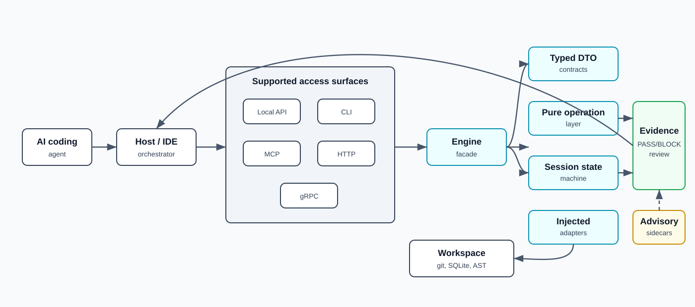
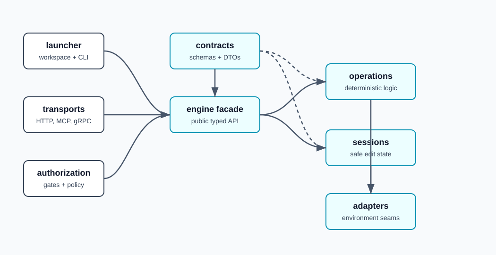
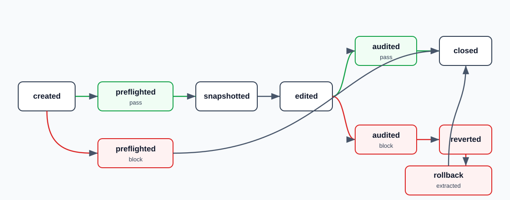
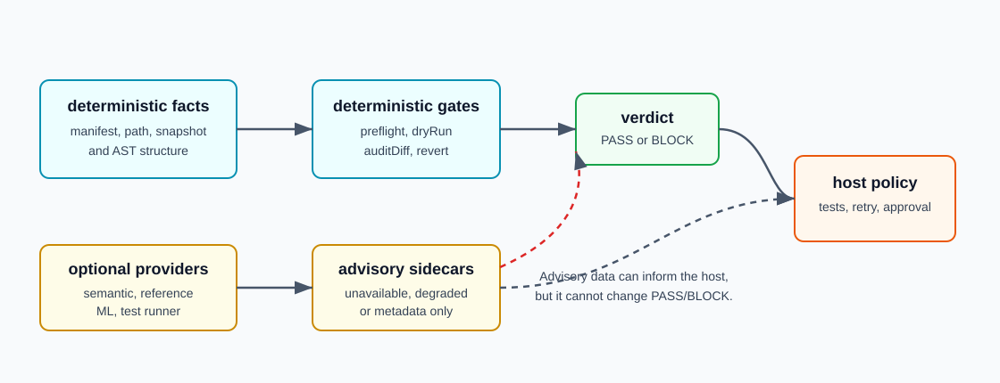

# Hoplon Architecture

This document describes the current implementation shape of Hoplon. It is
written as product and engineering truth: what exists, how it works, which
surfaces are default, and which capabilities are advisory or provider-bound.

## Current Runtime Truth

| Area | Current state |
|---|---|
| Package shape | Standalone TypeScript package with local API, CLI launcher, MCP, HTTP, and gRPC surfaces. |
| Default runtime | Local workspace, Node filesystem adapter, isomorphic-git versioning, sql.js snapshot store, async mutex locks, tree-sitter code intelligence, built-in secret scanner, noop optional providers, and startup reconciliation of stale pending snapshots. |
| Deterministic gates | `preflight`, `createSnapshot`, `dryRun`, `auditDiff`, `revertUncontracted`. |
| Read/search surface | `seeCodebase`, `packContext`, `queryStructure`, `extractStructuralTemplate`, `searchSymbols`, `describeProject`, `findSyntaxNode`, `findReferencingSymbols`. |
| Edit surface | `createHoplonEditSession`, session registry, `session_*` MCP/HTTP tools, `session_quick_edit`, chunk staging, review and repair payloads. |
| Advisory intelligence | Semantic search, blast radius, dependency impact, violation prediction, anomaly scoring, semantic gap sidecars, structural sandbox. |
| Session evidence | Launcher and registered-project sessions use the exact snapshot-store handle owned by their routed engine, so default audit coverage can derive post-snapshot files instead of reporting `declared_only`. |
| Authorization | Project registry and folder policy are supported. Capability-token, OPA, and RBAA paths are opt-in; default capability gate mode is off. Enforce-mode branch facts come only from an injected server resolver, and AST facts come from the dispatched `ast_node` target. Missing trusted facts remain fail-closed. |
| Branch behavior | Branches are authorization/evidence scope. Hoplon does not expose generic branch checkout or cross-branch search. |
| Transport gaps | `semanticSearch` and `indexSemanticCorpus` are local engine methods only. Remote clients return `remote_not_supported` for them. |
| Source architecture | Every TypeScript file under `src/hoplon` is limited to 300 lines by a positive and negative architecture test. Public barrels preserve the package surface while focused modules own implementation details. |

Strict engaged `see_codebase` read/search classifies root-level Markdown
project source docs whose names carry architecture, vision, roadmap, plan, or
prompt as approved prompt/source docs. Env files, logs, binary content,
invalid UTF-8, outside-folder targets, and arbitrary unlisted text remain
fail-closed.

## Public Distribution

The canonical open-source distribution is
[`justguy/hoplon`](https://github.com/justguy/hoplon). It contains the
deterministic kernel, public contracts, reference adapters, transports,
supervised sessions, optional adapter packages, and their proof corpus.

Hoplon originated inside Project Phalanx but has no runtime dependency on the
Phalanx orchestrator. The public package retains the `@phalanx/hoplon` name for
lineage and compatibility; any host can use the local API, CLI, MCP, HTTP, or
gRPC surfaces independently.

## System Model

The host asks for repository operations through typed DTOs. Hoplon validates the
request, routes it through operation code, calls injected adapters for all
environment access, and returns typed results. The engine never owns retry,
approval, shell execution, or governance policy.

## Layer Map

| Layer | Code | Responsibility |
|---|---|---|
| Contracts | `src/hoplon/contracts/**` | Zod schemas and TypeScript DTOs for every engine, session, transport, policy, and evidence surface. |
| Engine facade | `src/hoplon/engine/**` | Public `HoplonEngine` interface and barrels, adapter normalization, default/noop provider binding, operation wiring, and startup reconciliation. |
| Operations | `src/hoplon/operations/**` | Deterministic reads, audits, snapshots, preflight gates, semantic search seam, advisory analysis, context packing. |
| Adapters | `src/hoplon/adapters/**` | Filesystem, versioning, snapshot store, locks, emitters, code intelligence, scanners, vector stores, ML providers. |
| Sessions | `src/hoplon/session/**` | Ordered supervised edit state machine, staging, apply/mark edited paths, review, repair, verification, snapshot evidence. |
| Authorization | `src/hoplon/authorization/**`, `src/hoplon/transport/*Gate*` | Static auth, policy bundles, capability tokens, claims/runtime state, optional OPA/RBAA enforcement. |
| Launcher | `src/hoplon/launcher/**`, `src/bin/hoplon.ts` | Workspace resolution, status, query commands, project registration, HTTP/MCP serve commands. |
| Transports | `src/hoplon/transport/**`, `src/hoplon/mcp/**` | HTTP/gRPC/MCP dispatch, remote clients, strict-agent profiles, session routes, project and trace tools. |

## Engine Operation Groups

### Deterministic Gates

- `preflight(req)` validates manifest shape and registered gates before
  mutation.
- `createSnapshot(req)` captures a content-addressed baseline and writes
  snapshot/audit metadata through adapters.
- `dryRun(req)` evaluates proposed changes against the snapshot in memory. It
  never writes files or audit-log rows.
- `auditDiff(req)` compares live edits against the manifest and snapshot. It is
  syntactic/structural only.
- `revertUncontracted(req)` restores contracted files and deletes uncontracted
  post-snapshot files outside the allowlist.

### Read And Search

- `seeCodebase(req)` is the unified read/search macro. It selects structural,
  skeleton, raw, or mixed paths and reports provenance and fallback metadata.
  Batch requests can return `ok: true` with `data.partial: true` and
  `data.errors[]` when at least one target succeeds and other raw targets fail
  with recoverable per-target errors such as missing files or strict file-policy
  rejection. Requests with no successful target still return the typed
  `ok: false` error envelope, and invalid request syntax remains whole-request
  blocking.
- `packContext(req)` returns AST-bounded context slices.
- `queryStructure(req)` runs tree-sitter Query DSL patterns over selected files.
- `extractStructuralTemplate(req)` emits imports, exports, and top-level type
  structure.
- `searchSymbols(req)` finds declared JS/TS symbols with deterministic sorting.
- `describeProject(req)` reports language, file, import/export, type, function,
  and class counts over a bounded sample.
- `findSyntaxNode(req)` resolves typed AST node identity from a location.
- `findReferencingSymbols(req)` uses an optional reference provider and reports
  unavailable when the seam is not bound.

### Advisory Intelligence

- `semanticSearch(req)` and `indexSemanticCorpus(req)` are local, advisory,
  project-scoped, top-K bounded operations over host-bound embedding/vector
  adapters.
- `analyzeBlastRadius(req)` and dependency-impact sidecars use optional
  `findReferences` support.
- `predictViolationRisk(req)` and `scoreAnomaly(req)` are schema-pinned
  advisory results.
- `synthesizeInterfaceStubs(req)` and `ephemeralStructuralSandbox(req)` provide
  non-blocking planning and structure helpers.

Advisory operations cannot mutate files and cannot alter deterministic
`PASS`/`BLOCK` results.

## Supervised Edit Sessions

The session layer packages the safe edit loop:

Important properties:

- `applyEdits` writes through the injected `HoplonFsAdapter` and derives changed
  files from actual writes.
- `stageContent` buffers ordered non-binary chunks and only reaches disk through
  `applyEdits`.
- Staging defaults remain 5 MiB per chunk, 64 MiB per entry, 64 entries per
  session, and 4 GiB aggregate. A registry owns one aggregate budget shared by
  every session and wrapper it constructs; unrelated registries and direct
  sessions do not share ambient process state.
- `markEdited` is a compatibility declaration for host-owned writes.
- `dryRun`, `review`, `verifyBehavior`, and `snapshotEvidence` do not advance the
  primary edit state.
- `getRepairContext` is legal only after a `BLOCK` audit plus rollback-template
  extraction.
- `verifyBehavior` wraps a host-injected runner and returns `NOT_RUN` /
  `UNAVAILABLE` when no runner exists.
- Packaged registered-project sessions use the routed engine's exact live
  snapshot store, so audit coverage is derived by default. Foreign engines that
  do not expose the factory-owned store remain honestly `declared_only`.

The session registry backs HTTP and MCP tools such as `start_edit_session`,
`session_apply_edits`, `session_review`, `session_verify_behavior`,
`session_quick_edit`, and `session_close`.

## Adapter Defaults

| Capability | Default binding | Notes |
|---|---|---|
| Filesystem | Node fs adapter | Root-scoped; memfs available for tests. |
| Versioning | isomorphic-git | Snapshot commits, blob reads, scoped diffs, remote push/fetch seam. |
| Snapshot store | sql.js SQLite | PostgreSQL adapter exists for distributed deployments. |
| Locks | Async mutex | Sub-file/AST lock wrappers exist for session writes. The opt-in Redis Redlock adapter renews by default, accepts a validated custom renewal interval, and accepts `false` to disable renewal. Lost-lock callbacks are isolated from the watchdog promise. |
| Emitter | Noop | Console, memory, and OpenTelemetry emitters are available. |
| Code intelligence | tree-sitter | AST, symbols, queries, syntax nodes. Reference methods are optional. |
| Secret scanner | Built-in regex | Snapshot warnings, not default blocking. |
| Static analysis | Noop | External analyzer packages are opt-in. |
| Embedding/vector store | Noop | Required for real semantic search. |
| Anomaly/prediction | Noop | Reference implementations are opt-in. |
| Summarizer | Noop | Host-invoked only; engine operations do not call it. |
| DLP | Noop, warn policy | Block mode requires explicit config. |

## Deterministic Versus Advisory Authority

Deterministic authority is limited to manifest, path, snapshot, and AST facts.
`auditDiff` is syntactic only. It never uses semantic search, LSP/SCIP-style
references, model output, anomaly scores, test results, or risk predictions.

Advisory sidecars follow three rules:

1. They are schema-marked as advisory where relevant.
2. They report `UNAVAILABLE`, `DEGRADED`, `EMPTY`, or `NO_VERDICT` instead of
   fabricating certainty.
3. They cannot mutate files or change deterministic verdicts.

## Branch And Snapshot Evidence

Hoplon's version model is snapshot-centered:

- snapshots are content-addressed from stable manifest content
- snapshot rows include project, run, correlation, engine, schema, status, and
  git ref metadata
- default engine construction reconciles stale pending rows; recovery completes
  a row only when the stored ref resolves to the same commit and the commit's
  first message line binds that commit to the row's snapshot id
- snapshot evidence supports manifest-scoped diff, provenance, and
  line-provenance requests
- cross-snapshot diff is allowed only inside the same project/run scope
- branch names appear in authorization claims and policy audit evidence

This is not a generic git client. There is no agent-facing checkout, reset,
stash, tag, branch listing, or cross-branch search surface.

## Transport Exposure

| Operation family | Local API | CLI | MCP | HTTP/gRPC |
|---|---:|---:|---:|---:|
| Core gate operations | Yes | Limited | Yes | Yes |
| `seeCodebase` | Yes | `query see` | Yes | Yes |
| Symbol/project query | Yes | `query search`, `query project` | Yes | Yes |
| Structural query/template | Yes | `query structure`, `query skeleton` | Yes | Yes |
| Session workflow | Yes | Serve surfaces | Yes when registry is supplied | HTTP yes; remote session client yes |
| Snapshot evidence | Yes through session | No direct CLI | Session profile | HTTP session route |
| Semantic search | Local only | No | No | No direct transport; remote client reports unsupported |
| Project policy tools | Via launcher/support code | Yes | Yes when dependencies supplied | Yes when server configured |
| Trace/proof tools | When trace store exists | No direct CLI | Yes when trace store exists | Yes when configured |

The MCP SSE/HTTP transport creates one SDK server per client session. Its
default POST body ceiling is 16 MiB and is launcher-configurable. Session
liveness is checked before and after body collection, and the server-side close
acknowledgement resolves only after the session map entry and per-session MCP
resources have been cleaned up. Unknown or closed sessions fail with a typed
404 instead of crossing traffic into another client.

## Event And Evidence Discipline

Hoplon separates operational events from content-bearing evidence.

- Emitter events carry operation, phase, ids, duration, status, counts, and error
  kinds.
- Audit-log rows store bounded metadata and violation kinds, not source slices.
- Review, repair, and snapshot evidence payloads are explicit request results.
- Policy audit rows use bounded reason codes and redacted metadata.

This keeps logs useful for operations without turning them into an accidental
source-code or secret exfiltration channel.

## Invariants

- Adapters are the only environment seam.
- Public async engine methods accept typed DTOs and return typed DTOs.
- Snapshot and audit operations are scoped by project, run, and correlation id.
- `dryRun` is side-effect-free.
- `auditDiff` is syntactic and deterministic.
- Hoplon never owns retry or escalation policy.
- Missing providers surface as unavailable/noop, not fake success.
- The import wall is enforced by architecture tests.
- Hoplon source files are at most 300 lines; the architecture suite proves both
  the positive repository state and rejection of a 301-line source.

## Non-Goals

Hoplon does not provide:

- shell execution
- arbitrary raw writes
- general git porcelain
- generic cross-branch search
- broad IDE refactors
- model orchestration
- default blocking ML or semantic gates
- a replacement for host-owned tests or approval policy

## Proof And Testing Posture

The repo uses targeted Vitest suites plus architecture tests. Important proof
classes include:

- contract schema tests
- pure operation/unit tests
- session state-machine tests
- transport parity tests
- authorization and policy tests
- adapter tests for versioning, snapshot stores, emitters, scanners, and locks
- architecture import-wall tests
- architecture source-size tests, including a negative 301-line fixture

When changing a surface, run the narrow suite that owns that surface rather than
the full test suite by default.
